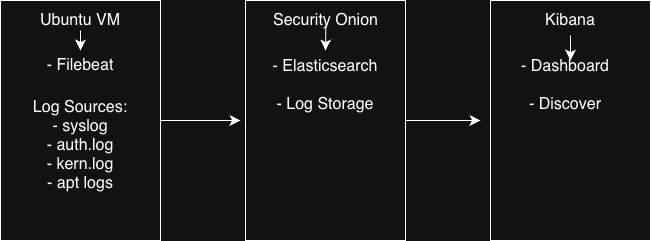
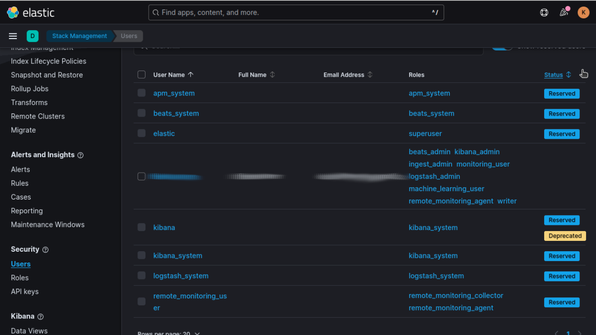

# SOC Homelab: Ubuntu Log Collection & Security Monitoring

This is a Security Operations Center (SOC) homelab that demonstrates enterprise style log collections from Ubuntu to Security Onion with real-time Kibana dashboards for security monitoring. 

## Technologies Used
- Filebeat 8.11.0 (Log collection)
- Security Onion 2.4 (Siem Platform)
- Elasticsearch (Log storage and search)
- Kibana 8.18.6 (Data visualization)
- Ubuntu 22.04 (Log Source)

## Architecture

## Quick Start Guide
### Prerequisites
- Security Onion deployed
- Ubuntu 
- Network connectivity between systems

### Install Filebeat
sudo apt update && sudo apt install filebeat

## Project Walkthrough

I configured the filebeat.yml file. I first tried to generate an API key in order for filebeat to be able to write indices to Kibana, but kept being met with a 401 error code. Though I did try and troubleshoot this issue, I could not figure it out, so I decided to use a username and password in order to be authenticated. 

You can see how I ran into issues and dealt with them here:

In Kibana I created a user, then inserted the credentials into the filebeat.yml file which worked! I gave the user permissions to manage beats, log parsing, and access to cluster monitoring features. 
